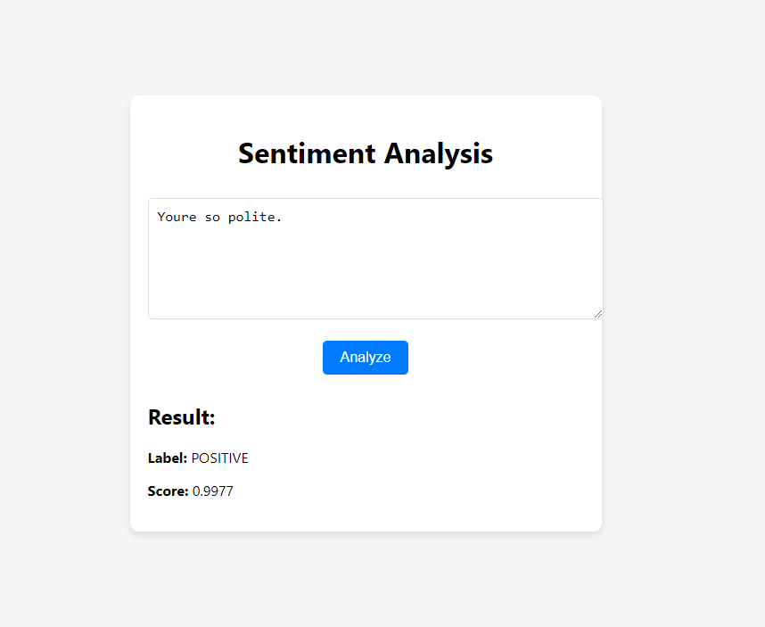
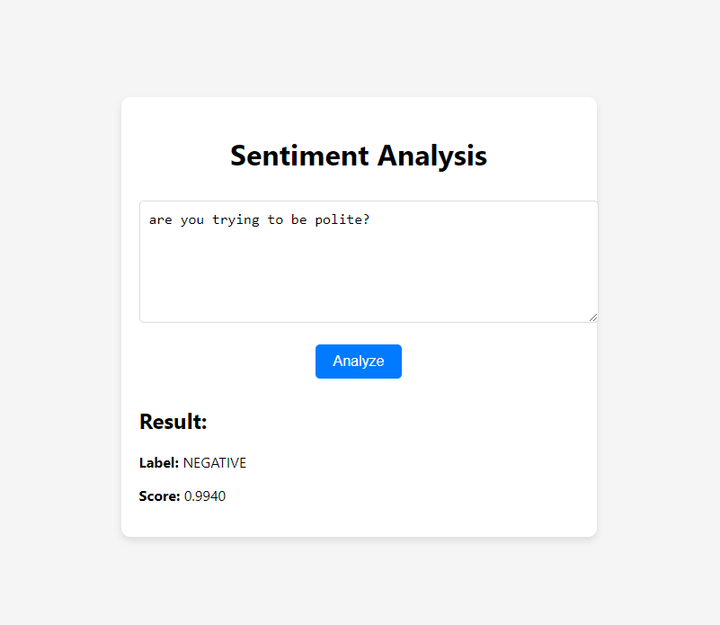

# sentiment_analysis_ap-i
# Sentiment Analysis Web Application

This is a simple web application that performs positive and negative sentiment analysis. It uses **FastAPI** for the api and **React** for the frontend.

The sentiment analysis model is powered by Hugging Face's pipeline API, which simplifies the use of pre-trained transformer models. In this case, the pipeline("sentiment-analysis") automatically loads a default sentiment analysis model. You can also define a specific model by specifying the model name within the pipeline, like this: sentiment_pipeline = pipeline("sentiment-analysis", model="your-model-name"). This allows flexibility in choosing different pre-trained models based on your requirements, whether it's the default model or a more specialized one for sentiment tasks.

---

## Project Setup


1. **Run the api**:
# Project Setup Instructions

## Setting Up the Backend

1. Create a virtual environment:
    ```bash
    python -m venv venv
    ```

2. Activate the virtual environment:
   - For Linux/MacOS:
     ```bash
     source venv/bin/activate
     ```
   - For Windows:
     ```bash
     venv\Scripts\activate
     ```

3. Install the required packages:
    ```bash
    pip install -r requirements.txt
    ```

4. Run the application with Uvicorn:
    ```bash
    uvicorn main:app --reload
    ```

## Setting Up the Frontend

1. Navigate to the frontend directory:
    ```bash
    cd sentiment-analysis-frontend
    ```

2. Install the frontend dependencies:
    ```bash
    npm install
    ```

3. Start the frontend application:
    ```bash
    npm start
    ```

## Additional Notes
- Ensure you have Node.js and npm installed on your machine for the frontend setup.



